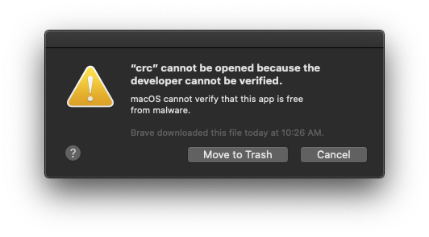
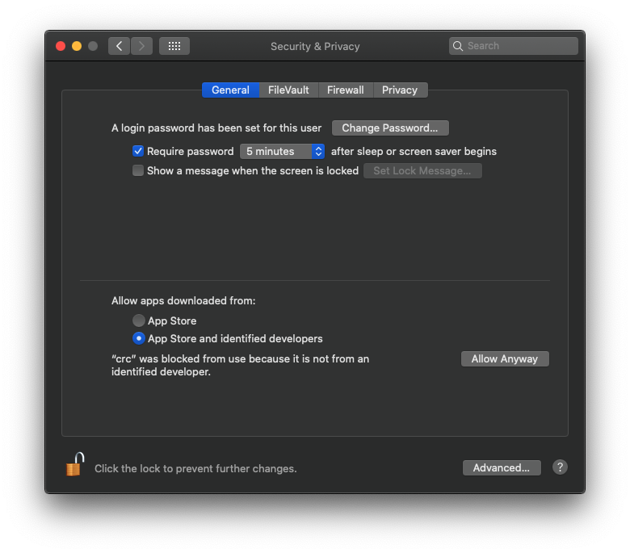

# Deploy with CodeReady

## Installation


1. [Create RedHat account](https://www.redhat.com/wapps/ugc/register.html?_flowId=register-flow&_flowExecutionKey=e2s1)
2. [Download CodeReady containers](https://developers.redhat.com/products/codeready-containers/overview), there is a download button on this page at the time of writing. It will take you to a page where you can login using the account you created in step 1.

[Official Doc](https://access.redhat.com/documentation/en-us/red_hat_codeready_containers/1.7/) for more details.


## After installation

Extract the `crc` binary to `~/.local/bin/crc`. You will likely get a security error like this:
 

which you can get by like so:
 


## Starting CodeReady

Run setup:
```
$ crc setup
```


Default memory is 8192, default cpus is 4. Double it for now (we may be able to trim some more):

```
$ crc config set memory 16384

$ crc config set cpus 8 
```


Once you run the next command, it will ask you for "Image Pull Secret" - which you can copy/download from [here](https://cloud.redhat.com/openshift/install/crc/installer-provisioned):

```
$ crc start
```


It takes about 15 minutes before `crc start` completes:

```
INFO To access the cluster, first set up your environment by following 'crc oc-env' instructions
INFO Then you can access it by running 'oc login -u developer -p developer https://api.crc.testing:6443'
INFO To login as an admin, run 'oc login -u kubeadmin -p xxxx https://api.crc.testing:6443'
```


Login as admin according to the password given in the previous step:

```
$ oc login -u kubeadmin xxxx https://api.crc.testing:6443
```

Then run

```
$ crc console
```

which opens up a browser. I could not login as developer, but kubeadmin credentials worked.


Then run the  `crc oc-env`  command to add the appropriate  `oc`  binary to your  `PATH`.

```
$ eval $(crc oc-env)
```


The documentation tells you to login as developers using `oc`, but I got:

```
$ oc get co
Error from server (Forbidden): clusteroperators.config.openshift.io is forbidden: User "developer" cannot list resource "clusteroperators" in API group "config.openshift.io" at the cluster scope
```

Again, it works with admin creds.


## Deploy Grey Matter

### One time setup:
We'll use helm3. Install or update if you haven't done so.

```
$ brew install helm
```

If you wish to use locally built charts, you can do:

```
$ git clone git@github.com:DecipherNow/helm-charts.git

$ cd helm-charts

$ git checkout release-2.2
```

Create credential file:

```
$ make credentials
```

Note: The default Grey Matter install pulls images from the `docker.production.deciphernow.com` repository. If you want to pull images from `docker-dev.production.deciphernow.com` instead, you will have to update all values.yaml files and modify credentials.yaml to use that repository.

### Actual steps:

`overrides/codeready.yaml` drastically reduces resource limits for the core Grey Matter services, which may cause problems. If you run into issues, please adjust the cpu and memory limits for CRC itself and for services listed in `overrides/codeready.yaml` to suit your needs.


```
$ oc login -u kubeadmin -p xxxx https://api.crc.testing:6443

$ helm dep up data
$ helm dep up fabric
$ helm dep up sense

$ helm install secrets secrets -f credentials.yaml

$ helm install edge edge -f overrides/codeready.yaml

$ helm install fabric fabric -f overrides/codeready.yaml

$ helm install data data --set=global.waiter.service_account.create=false -f overrides/codeready.yaml

$ helm install sense sense --set=global.waiter.service_account.create=false -f overrides/codeready.yaml

```

Dashboard will be accessible here:
https://edge-default.apps-crc.testing

### How to enable OpenShift monitoring (disabled by default)

https://code-ready.github.io/crc/#starting-monitoring-alerting-telemetry_gsg

```
$  oc get clusterversion version -ojsonpath='{range .spec.overrides[*]}{.name}{"\n"}{end}' | nl -v 0                                  
     0	cluster-monitoring-operator
     1	machine-config-operator
     2	etcd-quorum-guard
     3	machine-api-operator
     4	cluster-autoscaler-operator
     5	insights-operator
     6	prometheus-k8s
$ oc patch clusterversion/version --type='json' -p '[{"op":"remove", "path":"/spec/overrides/<the number next to cluster-monitoring-operator>"}]' -oyaml

```
### Uninstalling

Delete all deployments:
```
helm ls --all --short | xargs -L1 helm uninstall 
```

Delete OpenShift cluster:
```
crc delete
```
You can also stop it by running `crc stop` but it has never stopped cleanly and always ends up force stopping it.


## Additional Information

### How to expose ingress to Edge manually

```
oc expose svc/edge
```

### Debugging containers that won't start
<https://cookbook.openshift.org/logging-monitoring-and-debugging/how-do-i-debug-an-application-that-fails-to-start-up.html>
```
oc debug <name of the pod>
```
