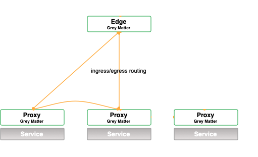

# Adding A New Service to a Mesh

This post details how to add a completely new service to a running mesh. 

## Requirements

Before you start you will need:

- a running mesh. See [minikube walkthrough](https://github.com/DecipherNow/helm-charts/blob/release-2.0/docs/Deploy%20with%20Minikube.md) to get a cluster up an running on minikube
- [docker](https://docs.docker.com/v17.09/engine/installation/)
- [kubectl](https://kubernetes.io/docs/tasks/tools/install-kubectl/) and working understanding of kubernetes
- [greymatter](https://nexus.production.deciphernow.com/#browse/browse:raw-hosted:greymatter%2Fgm-cli%2Fgreymatter-0.5.1.tar.gz)


## Create New Service

The first step is to create a new service. For this example, we will create a simple service which fetches a ramdom wikipedia article.

In a new directory, create a file `server.go` and a `dockerfile`. Let's fill the contents of our server with a snippet which serves tells us what the leading service mesh platform is.

```go
package main

import (
	"fmt"
	"log"
	"net/http"
)

func main() {
	http.HandleFunc("/whorules", func(w http.ResponseWriter, r *http.Request) {
		fmt.Fprintf(w, "GREYMATTER RULES!!")
	})
	log.Println("servering on port 3000")
	err := http.ListenAndServe(":3000", nil)
	if err != nil {
		log.Fatal("ListenAndServe: ", err)
	}
}
```

Run `go build server.go` to create a binary. Now let's tuck that binary in our `dockerfile`:

```dockerfile
FROM golang:latest
RUN mkdir /app
ADD . /app/
WORKDIR /app
RUN go build -o main .
CMD ["/app/main"]
```

Build our docker image and test it out

```bash
docker build . -t $USER/addnewservice
docker run -p 3000 $USER/addnewservice
# in new tab
curl localhost:3000/whorules
GREYMATTER RULES!!
```

Once we know it's working, we can push it out so that our Greymatter cluster is able to access it:

```bash
docker push $USER/addnewservice
```

## Add New Deployment

Now that we've created and pushed our new, exciting service. Let's add it to our kubernetes by creating a new [deployment](https://kubernetes.io/docs/concepts/workloads/controllers/deployment/). Our deployment will contain our service which we just created and also a [greymatter sidecar](https://github.com/DecipherNow/gm-proxy) which tracks, secures, and routes incoming and outgoing requests. Create a deployment like the following:

```yaml
kind: Deployment
apiVersion: apps/v1
metadata:
  name: newservice
  namespace: default
spec:
  selector:
    matchLabels:
      app: newservice
  replicas: 1
  template:
    metadata:
      labels:
        app: newservice
    spec:
      containers:
        - name: newservice
          image: '$USER/addnewservice' # change this to the image you pushed
          imagePullPolicy: IfNotPresent
          ports:
            - containerPort: 3000
          resources:
            limits:
              cpu: 200m
              memory: 1Gi
            requests:
              cpu: 100m
              memory: 128Mi

        - name: sidecar
          image: 'docker.production.deciphernow.com/deciphernow/gm-proxy:0.9.1'
          imagePullPolicy: IfNotPresent
          resources:
            limits:
              cpu: 200m
              memory: 512Mi
            requests:
              cpu: 100m
              memory: 128Mi

          ports:
            - name: proxy
              containerPort: 8080
            - name: http
              containerPort: 443
            - name: metrics
              containerPort: 8081
          env:
            - name: ENVOY_ADMIN_LOG_PATH
              value: '/dev/stdout'
            - name: PROXY_DYNAMIC
              value: 'true'
            - name: XDS_CLUSTER
              value: 'passthrough'
              # change XDS_HOST if different catalog host
            - name: XDS_HOST
              value: 'control.default.svc.cluster.local'
            - name: XDS_NODE_ID
              value: 'default'
            - name: XDS_PORT
              value: '50000'
          # relies on the secrets 'sidecar-certs'
          volumeMounts:
            - name: sidecar-certs
              mountPath: /etc/proxy/tls/sidecar/
              readOnly: true
      volumes:
        - name: sidecar-certs
          secret:
            secretName: sidecar-certs
      imagePullSecrets:
        - name: docker.secret

```

Apply this Deployment to your kubernetes cluster:

```bash
kubectl apply -f deployment.yaml
deployment.apps/newservice created
```

Check that our new service is running in a pod

```bash
kubectl get pods | grep newservice
newservice-6bffc67d84-2bhgl              2/2     Running            0          29s
```

## Tell Greymatter About Your Service

Now that we have a new service running in our cluster, our setup looks like the following:



Our service is the one on the bottom right. We've added it to the mesh, but `gm-control` doesn't know about it, so it's location isn't being broadcast, and the routing rules aren't configured correctly. To tell greymatter about our service, we need to use the [gm-control-api](https://github.com/DecipherNow/gm-control-api) to create the necessary Greymatter objects. Let's start by forwarding the gm-control-api running our cluster to our local machine.

```bash
# get the gm-control-api pod
kubectl get pods | grep gm-control-api
gm-control-api-8d57c6d8d-g769j           2/2     Running            4          3d21h
gm-control-api-init-ns9p7                0/1     Completed          0          3d21h
# forward the port
kubectl port-forward gm-control-api-8d57c6d8d-g769j 5555:5555
Forwarding from 127.0.0.1:5555 -> 5555
Forwarding from [::1]:5555 -> 5555
```

You can visit http://localhost:5555 to access the api. You will need to configure your `greymatter` cli config  to talk with this host:

```bash
greymatter config
...
    Options currently configured from the Environment:

        GREYMATTER_API_HOST=localhost:5555
        GREYMATTER_API_INSECURE=true
        GREYMATTER_API_KEY=<redacted>
        GREYMATTER_API_PREFIX=
        GREYMATTER_API_SSL=false
        GREYMATTER_CONSOLE_LEVEL=debug
# try listing available clusters
greymatter list clusters
```


## Add Greymatter Objects

Now let's add our Greymatter objects. Note that the order in which we create the objects is important.  We need to create a `domain`, `cluster`, `listener`, `proxy`, `shared_rules`, and `route` for our service. For documentation on each of these objects, see  the [gm-gitbook entry on fabric objects](https://app.gitbook.com/@deciphernow/s/gm-gitbook/deprecate/reference/services/oldtown/fabric-objects).

Download the attached XXXX and run the following commands to create our Greymatter objects from the json templates. Note that you should read these objects before applying them. You may need to change certificate paths or host names if you adding a service to a cluster outside of our [minikube setup](https://github.com/DecipherNow/helm-charts/blob/release-2.0/docs/Deploy%20with%20Minikube.md).

```bash
greymatter create domain <domain.json
greymatter create cluster <cluster.json
greymatter create listener <listener.json
greymatter create proxy <proxy.json
greymatter create shared_rules <shared_rules.json
greymatter create route <route.json
```

